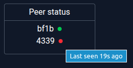

# Peer to Peer Video Player platform

A svelte based peer-to-peer video watching platform using PeerJS.
Users share a direct video URL and synchronise playback in real time.

Jellyfin URLs include additional integration features, such as expanding a single episode into an entire season playlist.


## Features

- Synchronised video playback - play/pause/seek/playback speed
- Peer status display (pictured)
- Custom built video controls
- Custom built subtitles parser, including size and offset controls
- "Ready check" function (pictured) - check connected peers are ready before video plays
- Emote system - send emoji reactions to connected peers
- Autoplay
- Sleep timer




## Tech Stack

- SvelteKit
- TypeScript
- PeerJS
- TailwindCSS

## Testing

The project includes a combination of unit and end-to-end tests focused on critical functionality.

Core logic is covered by Vite unit tests.

End-to-end tests are covered by Playwright for key user flows:
- Creating and joining a room
- Playlist and video loading
- Multi-peer synchronisation for video playback and playback controls
- Emote adding, sending and receiving
- Ready check
- Autoplay
- Host and member reconnecting

## Installation

Install with npm:
```sh
npm install
```

Run local version:
```sh
npm run dev
```

## Building

To create a production version:

```sh
npm run build
```

You can preview the production build with `npm run preview`.

