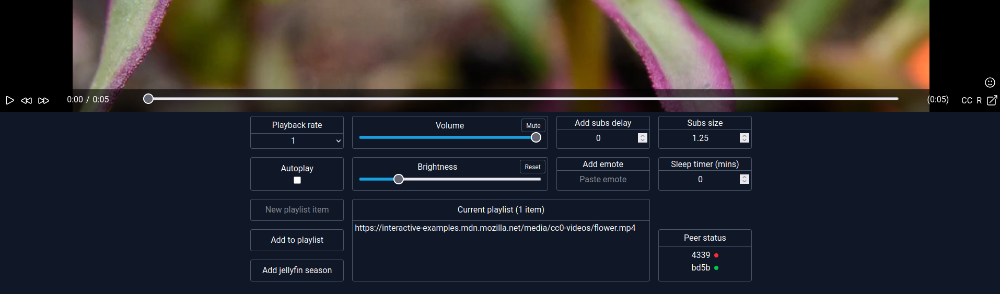
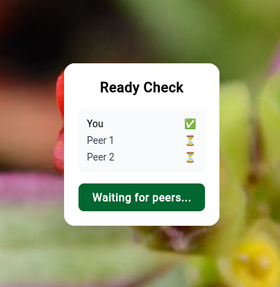

# Peer to Peer video platform

A svelte based peer-to-peer video watching platform using PeerJS.
Users share a direct video URL and synchronise playback in real time.

Jellyfin URLs include additional integration features, such as expanding a single episode into an entire season playlist.



## Features

- Synchronised video playback - play/pause/seek/playback speed
- Custom built video controls
- Custom built subtitles parser, including size and offset controls
- "Ready check" function (pictured) - check connected peers are ready before video plays
- Emote system - send emoji reactions to connected peers
- Autoplay
- Sleep timer



## Tech Stack

- SvelteKit
- TypeScript
- PeerJS
- TailwindCSS

## Installation

Install with npm:
```sh
npm install
```

Run local version:
```sh
npm run dev
```

## Building

To create a production version:

```sh
npm run build
```

You can preview the production build with `npm run preview`.

> To deploy your app, you may need to install an [adapter](https://svelte.dev/docs/kit/adapters) for your target environment.
